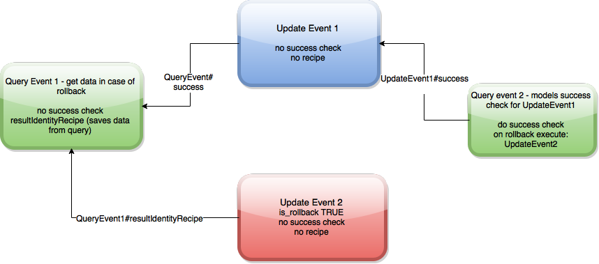

# Cassandra Transactions (CTS) - specification

## Two layers

1. Events core - basic building blocks: events, event data recipes, event dependencies
2. Events tx - uses building blocks to create layer that allows to represent transactions with such features as:

	- event preconditions
	- event success & failure checking
	- event rollbacks

## General ideas

_CTS_ will be created in similar mindset as Akka which is designed for distributed environment and local execution is done by means of optimization. Similary here, many areas i.e. callbacks to actors can be optimized to avoid going through network.

## Events core

_Events_ are statements that are executed at some time in the future. (when EventExecutor executes them).

Event has Event Type. Event Types are:

- Query Event - event that does _SELECT ..._ statement
- Update Event - event that does _UPDATE ..._ statement
- Insert Event - event that does _INSERT ..._ statement
- Delete Event - event that does _DELETE ..._ statement
- Event - event that executes arbitrary statement

### Event dependencies

Event can have dependencies on other events.

_EventDependency_ has structure:

- event name - required
- event recipe name - recipe name

Event begins to execute as soon as event with given name has been executed and named recipe produced results. 

##### Recipe's results in statement

Recipe's results are accessible in event statement. 
Example:

Event B depends on Event A. `EventDependency(name = "Event A", recipe = "calculatedValue")`. 
Let's say that Event A recipe with name `calculatedValue` produces single result with name `value` that is `1234`.

So in a map terms it is `calculatedValue -> value -> 1234`

Then Event B statement's could be defined to use that data in similar fashion to normal values that are added to statement like:

`UPDATE calculations `
`SET calculated_value = :calculatedValue.value `
`AND name = :someName WHERE calculation_id = :calculation_id`

Here `:calculatedValue.value` represents data obtained from other event.

`:someName` and `calculation_id` are values that were added during statement creation.

Note: Event's execution context is: all the data from other events recipes UNION WITH data added to statement during its creation

###### Multiple data required from same event
When data from multiple recipes is needed then event can declare multiple event dependencies on that event with different event recipe names.

###### Real representation of dependencies
In order to facilitate execution, instead of keeping dependencies inside event, events keep their dependents.

To make things clear: 

If Event A and Event B depend on Event C.
Then Event C has a list of dependents. Event A and Event B are in that list.

### Event can produce data using EventDataRecipes. 

Events can produce data which can be used by other events which depend on that event.
Although only _Query Event_ and general _Event_ could produce some results, it makes sense to treat all events in same way.

Data is produced by executing Event Data Recipes.

### EventDataRecipe
Event Data Recipe:

- is executed in context of what statement has returned
- Event Data Recipe has __name__ under which results it produces will be saved. 
- Event Data Recipe is always sent to an actor with data (could be none) returned by statement.
- Event Data Recipe is always executed by an actor

Event Data Recipe is either:

- _Expression_ that produces results, or
-  _Message to actor_ that responds with result.

In case of _Expression_ then message is sent to special `ExpressionEvaluator` actor. Local actor which evaluates expressions.

_EventDataRecipe_ produces _EventDataRecipeResult_ which is `Map[Result Name (String), EventResult (String)]`  
That means that single _EventDataRecipe_ can produce multiple results.

Results from all recipes are saved in event:

Results are a map: `Map[Event Data Recipe name (String), _EventDataRecipeResult_]`

so concretely it is: `Map[String, Map[String, String]]`

##### Expressions

Expression is a subset of language with operators like `+-*/  == != < > >= <=`
Expression is executed in a context. Context can be result of a select query.

__Example:__ For a Query like `SELECT user_name, user_email FROM users WHERE user_id = 101`
valid expression is: `user_name.size > 10` where size is a method on `String` object.

##### EventDataRecipe structure:

- name - name of data recipe
- actor name / path - send message to this actor to get map of results.
- ACKIng is acking required
- timeout - time to wait for return message
- expression - expression to evaluate in context of returned data from statement. 

EventDataRecipe is always sent to actor. If only _Expression_ is present and rest of values are `null` then message is sent to special `ExpressionEvaluator` actor (local actor which evalues expressions). _Expression_ will be evaluted in context of data returned by event execution.

### Algorithm to produce data from event

1. Execute event's statement 
2. Statement can return some results or none
3. Save data returned by statement to event. __TODO__ need to think about it because it might be done, by using something like _IdentityRecipe_ which just saves given data.
4. Run each __EventDataRecipe__ (explained below) in parallel
5. For each result produced by recipe, save it in event
5. If there is dependent event on completed __EventDataRecipe__ send recipe result to that event. __TODO__ that would require event to be an actor which waits for all its dependencies to be satisfied __is it a good idea?__
6. __Rollback functionality extends that algorithm to check for special _cts event success_ recipe__

Note: EventDataRecipe can be a message sent to actor even though there were no results. That allows to produce some results to be used by other events out of air by that custom actor.

#### EventDataRecipe protocol

TODO it is more less like that, possibly with more context in the outgoing message

outgoing message: `ProduceEventData(data = Results returned by statement, eventName, ...)`
incoming message: `EventDataResult(results: Map[String, String])`

## Events tx

### Revisited: EventDataRecipe and Event dependencies

If Event has no __ctsEventSuccess__ recipe which evaluates whether this event has been succeeded of failed then automatically `SuccessfulEventDataRecipe` will be run that produces: `success.value = true`. Saving that inside of event can be skipped.

Event dependencies could have optional recipe name, but if event only cares about successful execution and not data then by default recipe __ctsEventSuccess__ can be added.

Default EventDataRecipe and default dependency allows to treat success requirements as any other data requirements without special handling.

Summary: If no data recipe name is given during declaration of the dependency then success recipe is used. Success recipe is evaluted which always says success when there was no success recipe set.

### Event success checking
Event's exection can be _optionally_ checked for success. If there is no check for success then event is considered to successfully execute.

#### Representation on events level

There is __1__ EventDataRecipe named __ctsEventSuccess__ which produces one result named __value__. 

Note: there can be more recipes, but for success only this special one is evaluated.

Event is considered to execute successfully if `results.get(ctsEventSuccess).get(value) == true`

#### Concrete example of success checking
UPDATE/INSERT don't produce any results therefore in order to check it for success another query is required which will be evaluted for success. If it is failure then events will be rolled back (See Event rollback section).

Example: Set user to be active. Success if 1 row was affected. (this is maybe not very smart check)

Statements: 

- update is `UPDATE users SET is_active = true WHERE user_id = 10`
- success check is `SELECT COUNT(*) FROM users WHERE is_active = true AND user_id = 10` which is expected to be 1

There are __2 events__: 

- Update - that is UpdateEvent, 
- SuccessCheck - that is QueryEvent

There is __1 event dependency__ _QueryEvent_ depends on _UpdateEvent_  
Concretely _QueryEvent_ has `EventDependency(name = "UpdateEvent", recipe = None)`  

_QueryEvent_ has __ctsEventSuccess recipe__ which is expression `count = 1`

#### Execution algorithm
1. UpdateEvent is executed and user is updated
2. UpdateEvent has no _success_ recipe therefore its considered successfully executed and its dependencies can execute
3. QueryEvent is executed
4. It has recipe named `ctsEventSuccess` therefore that recipe needs to be evaluated before any events dependent on that event can execute.
5. Recipes are evaluated
6. If `ctsEventSuccess.value` is true then event executed successfully.

That means that _UpdateEvent_ executed successfully.

What happens when success.value is false? See Events Rollback section.

### Event preconditions
Event can have preconditions which has to be met in order to execute that event.

Event precondition example: Do an Update, but only when user is active.

So there are statements: 
`UPDATE users SET ... WHERE user_id = 10`
`SELECT is_active FROM users WHERE user_id = 10`
And there is precondition `user.is_active == true`

It could be modeled differently like:
`SELECT COUNT(*) FROM users WHERE user_id = 10 AND is_active = true`
And precondition `count = 1`

#### Representation on events level

There are __2__ events.

1. UpdateEvent which does `UPDATE users SET ... WHERE user_id = 10`
2. QueryEvent which does `SELECT is_active FROM users WHERE user_id = 10`

There is __1__ dependency: _UpdateEvent_ depends on _QueryEvent_

Concretely _UpdateEvent_ has `EventDependency(name = "QueryEvent", recipe = None)`

QueryEvent has success checking with Expression: `is_active` or `is_active == true` (same thing)

#### Execution algorithm
1. QueryEvent is executed
2. Its EventDataRecipes are run
3. Success recipe is checked
4. If success, then its dependency UpdateEvent is executed.

In summary: UpdateEvent is only executed when its precondition has been met which was the goal.

### Event rollback

Event rollback allows to rollback event in case of failure.
In order to do a rollback we need to introduce another execution path.

Executing events inside event group progresses with modifications therefore goes forward.
Rolling back is executing set of events which undo modifications therefore direction is backward.

#### Event extension:

- is_rollback - marks this event as rollback only event. That means that is should not be executed when going _forward_.
- execute\_on\_failure - list of event names to execute on failure. That allows to execute events that undo changes.

#### Event statement rewriting:

Update statement needs to rolled back with another Update statement, but with old data. Therefore it needs Query before first Update can execute.

#### Rolling back graph which explains rollback process

Execution steps:

1. client creates _Update Event 1_ with success check that is a query. Query gets modeled as _Query event 2_ and it has dependency on _Update Event 1_
2. _CTS_ prepares events in case of rollback
3. _Update Event 1_ gets rewritten to _SELECT_ query which is modeled as _Query Event 1_
4. _Update Event 1_ receives dependency on _Query Event 1_, because query needs to execute before update.
5. _Query Event 1_ will save query results to be accessible by _Update Event 2_
6. _Update Event 2_ will reverse _Update Event 1_ by using data from _Query Event 1_
7. Execution of event group begins
8. _Query Event 1_ is executed, it has no success check which means automatic success. 
9. Dependent _Update Event 1_ is executed, it has no success check with means automatic success.
10. Dependent _Query event 2_ is executed, it has success check.
11. Let's assume that success check returns false which means failure
12. Events from the list `on rollback execute` are executed
13. _Update Event 2_ begins to execute, it requires data from _Query Event 1_ which already has that data available
14. _Update Event 2_ executes and it has no success check
15. Event group has been executed, algorithm stops.

## TODO refactor sections below

#### Event in general

Event:

* belongs to single event group
* can be executed
* its execution is either successful or failed -- callback actor decides.
* is rolled back in case of failure
* events can have dependencies on each other
* dependent events execute only when event executed successfully

### Event Success or failure

What does it mean for event to be successfuly executed?

__TODO TABLE OF WHAT HAPPENS AFTER WHICH STATEMENT__ i.e. 
UPDATE doesn't return nothing. UPDATE is really an INSERT/UPDATE (TRUE UPDATE SHOULD HAVE PRECONDITION THAT DOES EXISTS)
INSERT can always override something (TRUE INSERT SHOULD HAVE PRECONDITION THAT ROW DOESN'T EXIST)

insert has IF NOT EXISTS -> built in precondition.
__insert doesn't return any results.__ How to know if it was successful? Do query.

Precondition ideas: Select Query with expected number of rows, but there is IF EXSITS clause

Sometimes it is easy to say, but not in general case.
Event is executed successfully if:

Success conditions:
	- none - just execute statement and move to next event
	- do query and match on results. 

| Query | Assertion/Expression to check | Comment |
|-------|-----------|---------|
|SELECT COUNT(*) WHERE ... | count == N | exact assertion on number of rows equal N |
|SELECT COUNT(*) WHERE ... | count < N | count lower than N |
|SELECT COUNT(*) WHERE ... | count <= N | count lower or equal than N |
|SELECT COUNT(*) WHERE ... | count > N | count greater than N |
|SELECT COUNT(*) WHERE ... | count >= N | count greater or equal than N |
|SELECT column1, column2 WHERE ... | column1 != null && column2 = 'Foo' | query columns and evaluate expression on results |

General form is: TODO TODO TODO TODO TODO TODO TODO 

- no exception was thrown
- row was inserted -- __there is no such information__ need to do query
- affected rows match with expected number i.e. - __there is no such information__ need to do query

		= N || >= N || <= N 
- arbitrary logic decides	- let's say we have _User_ and success is only when _user.active is true_

In general it is nearly impossible to think of all the cases of what does it mean to successfully execute. 

Therefore deciding about success or failure should be done by user with means to optimize for simple case.

		<SuccessFail checks> := <SuccessFail_check> | <SuccessFail_check> <SuccessFail checks>
		<SuccessFail_check> := <arbitrary> | <primitive>
		<primitive> := <NO_EXCEPTION> | <AFFECTED_ROWS_EQUAL(N)> | <AFFECTED_ROWS_LESS_THAN(N)> | <IS_TRUE(EXPRESSION)> | ...
		<EXPRESSION> := path.to.column
		
		arbitrary := actor ref

There can be __many success checks__ and success is only when all are successful.

#### Arbitrary success check
		
Message to _actor ref_ is sent and response whether this event was successfully executed is required.

Extras: ACKing, timeouts

Answer from success check is asynchrnous. Execution of subsequent events can be either:
 
  - blocked until decision arrives.
  - proceed assuming succces with rollback if answer decides about failure. TODO need to think if this is complex.

#### Preconditions

  Success or failure checking allows to model Event preconditions. 
  Use Case: Grant bonus to customer only if is active and has bought 10 items.
  
  This can be splitted into several events with dependnecies between them. Grant bonus (UPDATE/INSERT) will depend on two events, one query with success if active = true and one query for items.

### Rollback mechanics

Rollback happens when event execution has been decided to be failure.

Rollback is more likely to be deterministic although could be custom arbitrary piece of code.

|  Statement     |  Rollback | Comment                                  |
|----------------|----------- | ----------------------------------------- |
|  INSERT Values |   DELETE  | Many values (rows) ca                    |
|  UPDATE TTL    |  UPDATE   | __PROBLEM__ Need to know previous TTL    |
|  DELETE row    |  INSERT ROW | __PROBLEM__ Need to have all data from row |
|  DELETE rows    |  INSERT ROWS | __PROBLEM__ Need to have all data from all rows |
|  DELETE columns from rows    |  INSERT columns to ROWS | __BIG PROBLEM__ Needs to know column values plus needs to know which column value corresponds to which row |
 
__TODO__ need to check if Query Results object can be serialized to json (column definitions are required for rollback)

TODO is restore always possible?

Possible rollback scenarios:

* rollback by client via asynchronous callback.
* rollback by restoring data to previous state (requries READ for data + WRITE on rollback)

### Event dependencies

Event within event group can have multiple dependencies on other events which causes them to be executed sequentially. 

Examples:

  1. No dependencies

     If event **A** has no dependencies then it is executed in parallel with other events within event group.

  1. Single dependnecy

  If event **A** depends on event **B** then events are executed sequentially. 
  
  	1. Execute event **B**
  	2. If successfulyl executed event **B** then execute event **A**. 
  	   Else event **A** will not be executed.

 1. Multiple dependencies

	If  event **A** depends on events **E1**, **E2**, ..., **EN** and events **E1**, **E2**, ..., **EN** do not depend on each other nor on any other events then
	
	  1. Execute in parallel events **E1**, **E2**, ..., **EN**
      2. If successfully executed events **E1**, **E2**, ..., **EN** then execute event **A**
         Else event **A** will not be executed.
         

Summary:

* Events within event group forms directed acylic graph.   
* In general all cases derive from multiple dependencies. Single and No dependencies are just cases when dependency list has 1 or none elements.
* Circular dependencies are illegal and defining them **must** fail fast.

## Event Groups

**Event Group** is a set of events that can be executed as whole successfully or rolled back.
If execution of event fails then whole event group is rolled back.

**TODO do I know exactly what does it mean for event to fail?**

## Event Processor

Event processor consumes Event Group Stream and executes Event Groups sequentially. This guarantees that no locks are needed and there are no race conditions.

__Optimization__
  Event Groups can be executed in parallel if they do not act on same _CQL DataModel_ rows.

**Important**  
   It is not known in all cases which events act on which rows, but if it is known and there is    no collision then these event groups can be executed in parallel.
  
## Event data transfer

In general events should be simple statements that can be executed, but there are valid cases when in order to execute event some data is required.

Abstract example: You have to do query (__Event Query__) for some data and some of that data is required for update statement (__Event Update__ with dependency on __Event Query__)

In general flow looks like: 

		Query Data -> apply function -> Update data
		
__Query Data__ can return one or many rows with one or many columns.

__Apply function__ can be arbitrary logic like: 
  
  - extract column value
  - execute arbitrary piece of code that produces result.
 
__Update data__ can execute when all of its dependencies produce results.

If **Event A** requires data from **Event B** then is **must** have dependency on **Event B**.

Implementation details:
__Event A__ defines that is depends on __Event B__ and has __Event B.name__ on its dependency list.
__Event A__ defines that is required data from __Event B__ and specifies **name for result**.
__Event A__ specifies data requirements.

Data requirement can be:

   - Arbitrary callback message that sends back response in expected form within certain configurable timeout.

   Here there should be some protocol in place. 
   What needs to be defined:
   
      - __actorRef__ - actor to send message to which should answer with data.
      
      - __timeout__ - time to wait for data.

      - __name__ - name under which data from response is saved.
   
   - Data from some event in event group which imposes dependnecy relationship on that event.  
     What needs to be defined:
     
      - __event name__ - event that is dependnecy
      - __actorRef__ - actor to send event's result which applies function to it and answers with data.
      - __name__ - name under which data is saved
      - __timeout__ - time to wait for apply function and data.

In any case recevied data will be saved within event under specified __name__ so that if playback of event is required, no communication with actorRef (which probably won't exist) is necessary.

## Event Pre & Post execution hooks

- Pre hook: can specify actorRef (name or path) which gets message **before** _Event_ is executed.
- Post hook: can specify actorRef (name or path) which gets message **after** _Event_ is executed.

Guarantees:

- a message is always sent to pre hook actor. Fire & forget fasion.
- post hook always receive message whether event succeeded or failed
- Event execution will not wait for _ACK_ (if acking set) from _PreHook_ which means that under bad network conditions _PostHook_ might receive message first and then _PreHook_.

Extras:
- optional ACKing for delivery of pre & post hook messages.

### Valid uses of pre & post hooks:

Progress report - report on progress to some high level components  
Trigger actions - could submit another event group doing something else. Could be thought as nested transaction (althought it will only be executed concurrently if it does not modify same rows and there are no other Event Groups waiting for execution).

## Event Group Pre & Post execution hooks 

### Valid uses of pre & post hooks:

Pre hook could start up some actors that could potentially be required for further processing on event group, but that requires built in hook type and props for actor.

Props are serializable.
If on _CTS_ side deserialization has all classes available (by using custom class loader) then _Props_ can be deserialized and actor can be created.

##### Custom classloader 
can look exactly like the one used for Cassandra triggers.

#### Implementation detail:
  I didn't expect event groups to be present as such somewhere but only as logical grouping of events within same group id. In order to implement Pre&Post hooks EmptyEvent can be introduced.
  EmptyEvent won't have any statement to execute nor values, but can have dependencies and other hooks defined. 
  
  __Pre Event Group hook:__
      Modify all events to depend on _EmptyEvent_. When _DAG_ is created, _EmptyEvent_ will be first to execute, its pre execute hook will be Pre Event Group hook.
      
  __Post Event Group hook:__
      _EmptyEvent_ which depends on all other events within EventGroup. When DAG is created, _EmptyEvent_ will be last to execute, its post execute hook will be Post Event Group hook.
      
      
## Library loading

Predefined hooks which startup actors (moving computation to data kind of thing) will require classes and its dependencies to be present.

Options: Do it as triggers in Cassandra -> put JAR into Cassandra installation

Feature: Resolving dependnecy automatically just like in build tool (Maven, Ivy)

__TODO__ for prototype let's just investigate how it is done with triggers.

**Crazy idea:** If there could be event's that could load jars, that would resolve dependnecy and load it (and unload older version) then data would evolve with code without worrying about migrations, because until some time version v1.0.0 is used and then after some event in Event Stream version v2.0.0 is used.
      
       
       
## Modeling of common use cases using events

### Delete many rows using prior Select Query
 

         